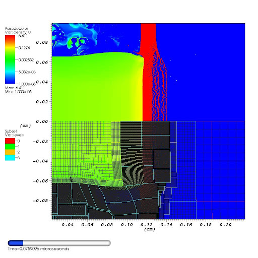

# Examples
## PISALE
<figure markdown="span">
  { width="500" }
  <figcaption>Modeling of X-ray free electron laser heating of water droplet.</figcaption>
</figure>
---
<figure markdown="span">
  { width="500" }
  <figcaption>3d surface tension models of ellipsoid oscillation.</figcaption>
</figure>
---
<figure markdown="span">
  { width="500" }
  <figcaption>Plate heated from left producing blowoff and rear surface spall. Mesh using AMR is shown in lower half of image.</figcaption>
</figure>
---
<figure markdown="span">
  { width="500" }
  <figcaption>A modeled hohlraum cooling ring expanding.</figcaption>
</figure>
---
<figure markdown="span">
  { width="500" }
  <figcaption>The impact of a steel sphere at 45 degrees on an aluminum plate..</figcaption>
</figure>
