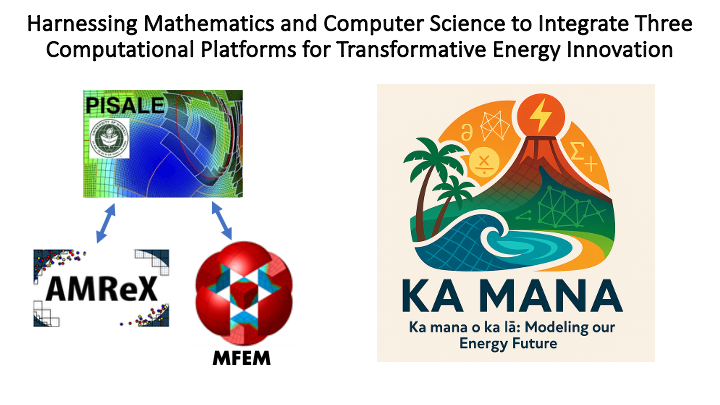

  

# Ka mana o ka lā: Modeling our Energy Future
The Ka Mana team is a collaboration between three major code groups to address multiple Energy issues with applied mathematics and computer science. At its core is the general-purpose code [PISALE (Pacific Island Structured adaptive mesh refinement with Arbitrary Lagrangian Eulerian)](https://pisale.bitbucket.io/). It uses numerical techniques to model problems associated with Energy production.

Alongside it is the [AMReX](https://amrex-codes.github.io/amrex/) code, a block-structured adaptive mesh refinement framework with support for hierarchical mesh and particle data with embedded boundaries. As part of this project we have enabled PISALE simulations to evolve AMReX-based particles in the PISALE computational domain.

Last but not least, the [MFEM](https://mfem.org/) code uses the finite element method to solve partial differential equations on unstructured grids with high-order functions and flexible meshes. MFEM and PISALE coupling has been tested on subsurface flow and transport and an on-going NSF project successfully.

## Science Foundations for DOE's Energy Future
This project drives research cutting edge energy solutions. The Ka Mana team focuses scientific support for multiple important energy areas including processes related to geothermal solutions, fusion, and cutting edge technologies.
Our team is fortunate to be funded by the [US Department of Energy grant DE-SC0024728](https://science.osti.gov/Initiatives/SCEarthshots/Foundations) to focus on crosscutting, fundamental research.
