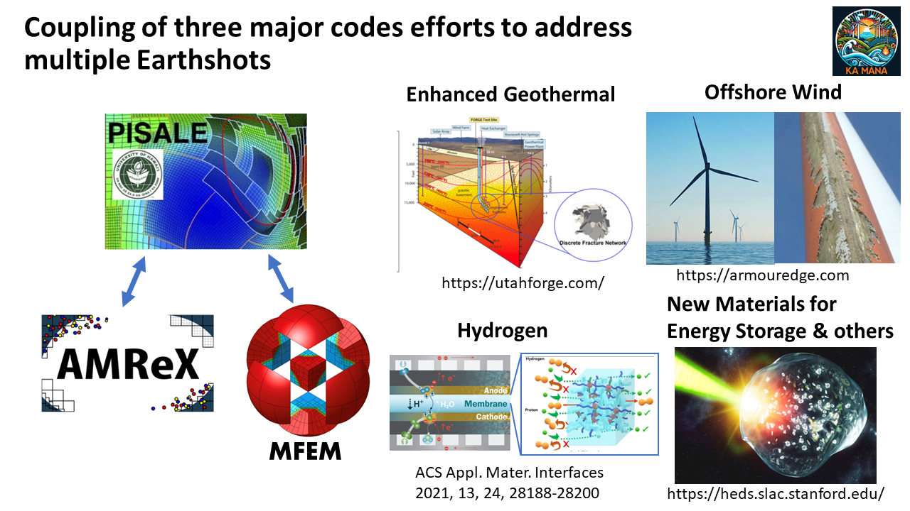

<figure markdown="span">
  { width="800" }
</figure>

# Ka mana o ka lā: Modeling our Energy Future
The Ka Mana team is a collaboration between three major code groups to address multiple Earthshots climate issues with applied mathematics and computer science. At its core is the general-purpose code [PISALE (Pacific Island Structured adaptive mesh refinement with Arbitrary Lagrangian Eulerian)](https://pisale.bitbucket.io/). It uses numerical techniques to model problems associated with Earthshots goals.

Alongside it is the [AMReX](https://amrex-codes.github.io/amrex/) code, a block-structured adaptive mesh refinement framework with support for hierarchical mesh and particle data with embedded boundaries. The ARMeX capabilities make it an excellent option for coupling with PISALE to model particles. So far, the team has began work coupling AMReX with PISALE. We still have to create and initialize ARMeX particle data containers in PISALE.

Last but not least, the [MFEM](https://mfem.org/) code uses the finite element method to solve partial differential equations on unstructured grids with high-order functions and flexible meshes. MFEM and PISALE coupling has been tested on subsurface flow and transport and an on-going NSF project successfully.

## DOE's Energy Earthshots
The DOE's [Energy Earthshots initiative](https://www.energy.gov/energy-earthshots-initiative) drives research in climate change and clean energy solutions. The Ka Mana team focuses on four Earthshots programs:

* Offshore wind turbines.
* Enhanced geothermal energy.
* Hydrogen energy.
* Long duration energy storage and crosscutting.

## Science Foundation for the Energy Earthshots
Our team is fortunate to be funded by the [US Department of Energy grant DE-SC0024728](https://science.osti.gov/Initiatives/SCEarthshots/Foundations) to focus on crosscutting, fundamental research.
