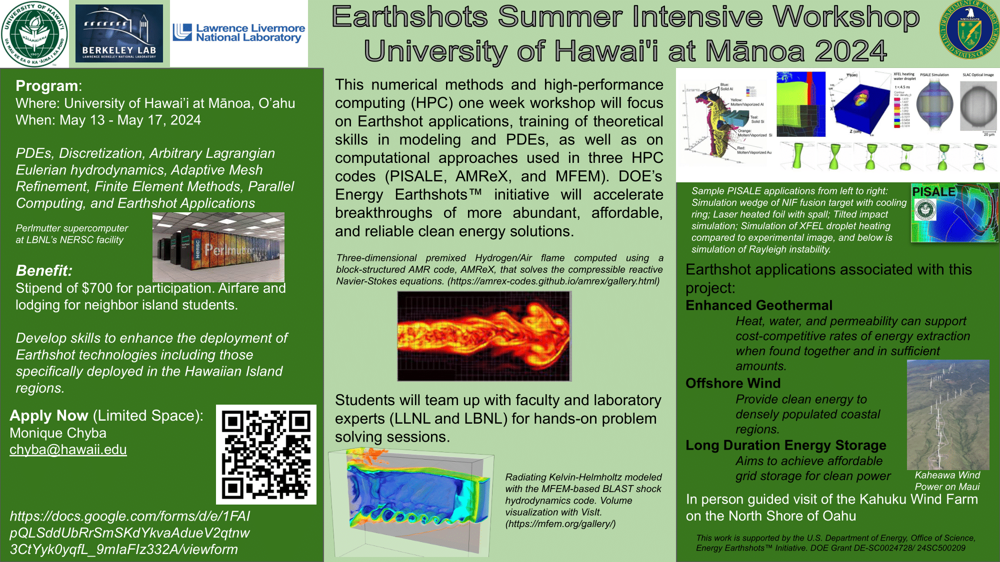

<figure markdown="span">
  { width="1200" }
</figure>

# Earthshots Summer Intensive Workshop at the University of Hawai'i
As part of the Earthshots grant, the team is arranging a numerical methods and high-performance computing workshop with a focus on Earthshots applications, theoretical mathematics, and computational mathematics. Student interns will collaborate with university faculty and computational laboratory experts to solve hands-on problem solving sessions.

In a collaboration with the UH Information Technology Service Cyberinfrastructure and HOCc cluster KOA, UH Data Sciences Institute, and UH Mānoa's Laboratory for Advanced Visualization & Applications, the first years summer workshop will take place May 13 to May 17 at the University of Hawaii at Mānoa with a trip to the Kahuku Wind Farm. Current student applicants have a variety of backgrounds such as engineering, atmospheric science, computer and information science, and mathematics.

## [Click Here for Workshop Schedule](https://drive.google.com/file/d/1bMrFgZuKjd0HYd2b8tQNB8c24HgA_N9E/view?usp=drive_link)

??? Monday Items
    <iframe width="560" height="315" src="https://www.youtube.com/embed/videoseries?si=sCBXAUWVWBFlPHsr&amp;list=PLeDdvLfFVepA_FZjO-ODeKQcGJCDQMW9j" title="YouTube video player" frameborder="0" allow="accelerometer; autoplay; clipboard-write; encrypted-media; gyroscope; picture-in-picture; web-share" referrerpolicy="strict-origin-when-cross-origin" allowfullscreen></iframe>   
    *The embedded video is a playlist!*

    [PISALE Presentation](https://docs.google.com/presentation/d/1n-HgTtd9GH1MEQvYSpfWLOsZhWo0A-ow/edit?usp=drive_link&ouid=110939561710664977897&rtpof=true&sd=true)

??? Tuesday Items
    <iframe width="560" height="315" src="https://www.youtube.com/embed/videoseries?si=xsaDnIyxMyId6Yd0&amp;list=PLeDdvLfFVepAh-UIIJvERoGOWIgyHbHsO" title="YouTube video player" frameborder="0" allow="accelerometer; autoplay; clipboard-write; encrypted-media; gyroscope; picture-in-picture; web-share" referrerpolicy="strict-origin-when-cross-origin" allowfullscreen></iframe>

    [MFEM Presentation](https://drive.google.com/file/d/1onFYP3cFNmD7KTomhsQVIqviw_x1UdVe/view?usp=drive_link)

??? Wednesday Items
    <iframe width="560" height="315" src="https://www.youtube.com/embed/videoseries?si=bRga1SPszUlqYcpw&amp;list=PLeDdvLfFVepC5aMM9vjJ2K40Dlz_gRn57" title="YouTube video player" frameborder="0" allow="accelerometer; autoplay; clipboard-write; encrypted-media; gyroscope; picture-in-picture; web-share" referrerpolicy="strict-origin-when-cross-origin" allowfullscreen></iframe>

??? Thursday Items
    <iframe width="560" height="315" src="https://www.youtube.com/embed/videoseries?si=JNeVpOBRGurzSfHP&amp;list=PLeDdvLfFVepAmw5Kz52tc6VVOdBA0r8V7" title="YouTube video player" frameborder="0" allow="accelerometer; autoplay; clipboard-write; encrypted-media; gyroscope; picture-in-picture; web-share" referrerpolicy="strict-origin-when-cross-origin" allowfullscreen></iframe>
    *Notice: Many of the Thursday video files were corrupted and are lost*

    [AMReX Presentation](https://drive.google.com/file/d/1YmqR8YW-OzJgzcOLkZxtoeYaefWOTpxA/view?usp=drive_link)
